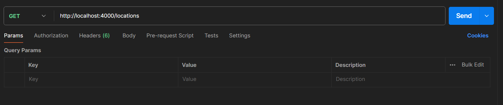

# weather-forecast-server
Server for weather app including the API endpoints.

steps:
1. On the terminal, hit "npm i" to install all the necessary packages
2. In server.js file enter your mongodb URI in proper format.

3. After that run "node server.js" to run the server
4. Current port value is 4000. You can change the port no in code.
5. The endpoints will be accessible from postman as given below example

 //GET ALL LOCATIONS
 

 //ADD LOCATION
 

 //DELETE LOCATION
 

 Make sure to pass the body for ADD or DELETE Api.